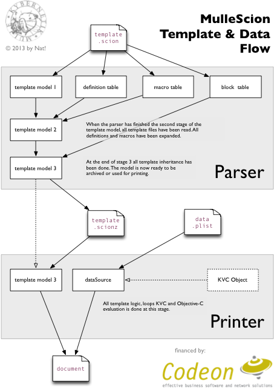

# MulleScion

🌱 A modern template engine for Objective C

(written in an oldfashioned way)


Build Status | Release Version
-------------|-----------------------------------
[](https://travis-ci.org/MulleWeb/MulleScion) |  [](https://travis-ci.org/MulleWeb/MulleScion)


> This is a fork of [mulle-kybernetik/MulleScion](//github.com/mulle-kybernetik/MulleScion)
> tailored for use in mulle-sde projects

***

It's **heavily** (very heavily) inspired by

[TWIG](//twig.sensiolabs.org/) "The flexible, fast, and secure template
engine for PHP"

*MulleScion* is fairly flexible, reasonably fast and can be made as
 secure as you wish.

* **Reasonably
Fast** :      *MulleScion* can compile templates into a compressed
               archive format. Loading such an archive ought to be lots faster
               than parsing (but because the parse is so fast, maybe isn't).
               A compiled template is read-only, you can use it many
               times to render different output from different input.

* **Secure** :   *MulleScion* has hooks so your application can ensure
               that untrusted template code doesn't have access to all of the
               applications data.

* **Flexible** :    There is the possibility of extending KVC and writing your
               own "builtin" fuctions. A template can (if allowed) execute
               arbitrary ObjC code. MulleScion has a powerful define like
               preprocessing capability and macros to expand your template
               vocabulary.

Here is a simple example, where ObjC code is embedded in a template:

``` twig
<html>
   <!-- rendered by {{ [[NSProcessInfo processInfo] processName] }} on
        {{ [NSDate date] }} -->
   <body>
     
         
         <table>
            <tr><th>TimeZone</th></tr>
         
            <tr><td>{{ item }}</td></tr>
         
         </table>
         
      
         Sorry, no timezone info available.
      
   </body>
</html>
```

Using MulleScion the creation of a string from your
object using a template file is as easy as:

``` objective-c
   NSString  *output;

   output = [MulleScionTemplate descriptionWithTemplateFile:@"test.scion"
                                                 dataSource:self];
```

This is the general architecture of *MulleScion*



*MulleScion* is happily used in a commercial project and has gone through
enough iterations to pronounce it "ready for production".


HTML PREPROCESSOR
=============
There is a companion project
[MulleScionHTMLPreprocessor](//github.com/MulleWeb/MulleScionHTMLPreprocessor)
that uses HTML like tags, to make the template easier to reformat in
HTML editors:

``` html
<html>
  <!-- rendered by {{ [[NSProcessInfo processInfo] processName] }} on
        {{ [NSDate date] }} -->
  <body>
    <for item in [NSTimeZone knownTimeZoneNames]>
      <if item#.isFirst>
        <table>
          <tr><th>TimeZone</th></tr>
      </if>
        <tr><td>{{ item }}</td></tr>
      <if item#.isLast>
        </table>
      </if>
    <else/>
      Sorry, no timezone info available.
    </for>
  </body>
</html>
```


Add
======

Use [mulle-sde](//github.com/mulle-sde) to add MulleScion to your project:

```
mulle-sde dependency add --objc --github MulleWeb MulleScion
```


Install
=======

Use [mulle-sde](//github.com/mulle-sde) to build and install MulleScion and
all its dependencies:

```
mulle-sde install --prefix /usr/local \
   https://github.com/MulleWeb/MulleScion/archive/latest.tar.gz
```


TOOLS
=============
There is an interactive editor available for OS X called
[MulleScionist](https://www.mulle-kybernetik.com/software/git/MulleScionist/),
which allows you to edit a HTML scion template and preview the results at the
same time.


DOCUMENTATION
=============

The documentation is contained in a companion project
[mulle-scion](//github.com/mulle-scion).

MulleScion is very similar to TWIG, so you can glean much of relevance from
<http://twig.sensiolabs.org>. If you see a feature in TWIG but don't see it in
the tests file, it's likely not there (but it's probably easily achieved some
other way (using a `define` or a `macro` or an ObjC category on **NSString**).


LIMITATIONS
=============
Because you can execute arbitrary ObjC methods, and have access to Key Value
Coding, MulleScion can pretty much do anything. *MulleScion* uses
`NSInvocation` for method calls. That means there will be problems with variable
arguments methods. Be wary of anything using structs and C-Arrays and
C-strings, although *MulleScion* tries to be as helpful as possible.

*MulleScion* does not do arithmetic or bitwise logic, quite on purpose.

*MulleScion* `&&` and `||` have no operator precedence, use parentheses.

*MulleScion* doesn't prevent you from trying stupid things.

The documentation is not very good, actually it is just more or less a
collection of test cases with comments...


TODO
=============
It might be nice to have delayed evaluation for render results. More tests.

ADD
====

Use [mulle-sde](//github.com/mulle-sde) to add MulleScion to your project:

```
mulle-sde dependency add --objc --github MulleWeb MulleScion
```


AUTHOR
=============
Coded by Nat!
2013-2020 Mulle kybernetiK

Contributors: @hons82 (Hannes)

