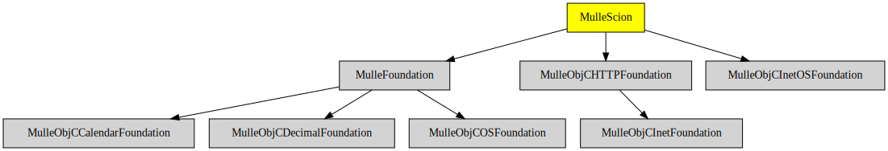

# MulleScion

#### 🌱 A modern template engine for Objective C

(written in an oldfashioned way)

> This is a fork of [mulle-kybernetik/MulleScion](//github.com/mulle-kybernetik/MulleScion)
> tailored for use in mulle-sde projects


| Release Version                                       | Release Notes
|-------------------------------------------------------|--------------
|  [](//github.com/MulleWeb/MulleScion/actions) | [RELEASENOTES](RELEASENOTES.md) |


## Example

Here is a simple example, where ObjC code is embedded in a template:

``` twig
<html>
   <!-- rendered by mulle-scion on
        2024-01-13T15:12:39Z -->
   <body>
   </body>
</html>
```

Using MulleScion the creation of a string from your
object using a template file is as easy as:

``` objective-c
   NSString  *output;

   output = [MulleScionTemplate descriptionWithTemplateFile:@"test.scion"
                                                 dataSource:self];
```


## Info

This is the general architecture of *MulleScion*


*MulleScion* is happily used in a commercial project and has gone through
enough iterations to pronounce it "ready for production".


### HTML PREPROCESSOR

There is a companion project
[MulleScionHTMLPreprocessor](//github.com/MulleWeb/MulleScionHTMLPreprocessor)
that uses HTML like tags, to make the template easier to reformat in
HTML editors:

``` html
<html>
  <!-- rendered by mulle-scion on
        2024-01-13T15:12:39Z -->
  <body>
    <for item in [NSTimeZone knownTimeZoneNames]>
      <if item#.isFirst>
        <table>
          <tr><th>TimeZone</th></tr>
      </if>
        <tr><td></td></tr>
      <if item#.isLast>
        </table>
      </if>
    <else/>
      Sorry, no timezone info available.
    </for>
  </body>
</html>
```


### Documentation

The documentation is contained in a companion project
[mulle-scion](//github.com/MulleWeb/mulle-scion).

MulleScion is very similar to TWIG, so you can glean much of relevance from
<http://twig.sensiolabs.org>. If you see a feature in TWIG but don't see it in
the tests file, it's likely not there (but it's probably easily achieved some
other way (using a `define` or a `macro` or an ObjC category on **NSString**).


### LIMITATIONS

Because you can execute arbitrary ObjC methods, and have access to Key Value
Coding, MulleScion can pretty much do anything. *MulleScion* uses
`NSInvocation` for method calls. That means there will be problems with variable
arguments methods. Be wary of anything using structs and C-Arrays and
C-strings, although *MulleScion* tries to be as helpful as possible.

*MulleScion* does not do arithmetic or bitwise logic, quite on purpose.

*MulleScion* `&&` and `||` have no operator precedence, use parentheses.

*MulleScion* doesn't prevent you from trying stupid things.

The documentation is not very good, actually it is just more or less a
collection of test cases with comments...

### You are here




## Add

Use [mulle-sde](//github.com/mulle-sde) to add MulleScion to your project:

``` sh
mulle-sde add github:MulleWeb/MulleScion
```

## Install

### Install with mulle-sde

Use [mulle-sde](//github.com/mulle-sde) to build and install MulleScion and all dependencies:

``` sh
mulle-sde install --prefix /usr/local \
   https://github.com//MulleScion/archive/latest.tar.gz
```

### Manual Installation

Install the requirements:

| Requirements                                 | Description
|----------------------------------------------|-----------------------
| [MulleFoundation](https://github.com/MulleFoundation/MulleFoundation)             | 💍 Umbrella library for the MulleFoundation
| [MulleObjCHTTPFoundation](https://github.com/MulleWeb/MulleObjCHTTPFoundation)             | 🎫 HTTP and HTML utility methods and classes for mulle-objc
| [MulleObjCInetOSFoundation](https://github.com/MulleFoundation/MulleObjCInetOSFoundation)             | 📠💻 OS specific extensions to NSHost and NSURL
| [mulle-objc-list](https://github.com/mulle-objc/mulle-objc-list)             | 📒 Lists mulle-objc runtime information contained in executables.

Download the latest [tar](https://github.com/MulleWeb/MulleScion/archive/refs/tags/latest.tar.gz) or [zip](https://github.com/MulleWeb/MulleScion/archive/refs/tags/latest.zip) archive and unpack it.

Install **MulleScion** into `/usr/local` with [cmake](https://cmake.org):

``` sh
cmake -B build \
      -DCMAKE_INSTALL_PREFIX=/usr/local \
      -DCMAKE_PREFIX_PATH=/usr/local \
      -DCMAKE_BUILD_TYPE=Release &&
cmake --build build --config Release &&
cmake --install build --config Release
```

### Platforms and Compilers

All platforms and compilers supported by
[mulle-c11](//github.com/mulle-c/mulle-c11).


## Author

[Nat!](https://mulle-kybernetik.com/weblog) for Mulle kybernetiK  
[@hons82 (Hannes)]()  

